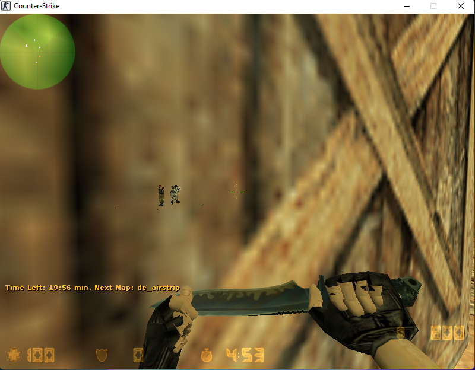

# GoWallhack
 A wallhack for Counter-Strike 1.6 written in Golang and CGo

## Building Requirements
- Go 1.18
- GCC for 32 bits (because of CGo)

## How to build the dll
Use the bash scripts to build the dll
- make-debug.sh
- make-release.sh

## License
This code is released under the MIT license, please checkout the [LICENSE](LICENSE) file for more information.

B#